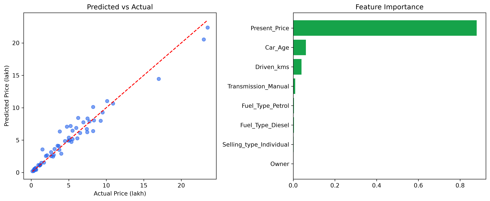

# 🚗 Car Price Predictor

### Used-car resale price prediction with Linear Regression and Random Forest

[Python](https://www.python.org/) • [Pandas](https://pandas.pydata.org/) • [Scikit-learn](https://scikit-learn.org/) • [Matplotlib](https://matplotlib.org/) • [Random Forest](https://scikit-learn.org/stable/modules/ensemble.html#random-forests)

> A machine-learning regression project that predicts the **resale (selling) price of a used car** from its **age, mileage, fuel type, seller type, transmission, and original price**. The project compares **Linear Regression** and **Random Forest** models to determine which approach performs better on used-car pricing data.
>
> Trained on the classic [Vehicle Dataset from CarDekho](https://www.kaggle.com/datasets/nehalbirla/vehicle-dataset-from-cardekho) containing **301 listings and 9 columns**.

---

## ✨ Features

| **Capability** |                                                        |
| -------------- | ------------------------------------------------------ |
| 🚗             | Used-car resale price prediction                       |
| 📊             | Comparison between Linear Regression and Random Forest |
| 🌲             | Random Forest regression with 100 trees                |
| ⚙️             | Automated feature engineering                          |
| 📅             | Converts `Year` into meaningful `Car_Age`              |
| 🔤             | One-hot encoding for categorical features              |
| ✂️             | 80/20 train/test split                                 |
| 📏             | Model evaluation using R², MAE, and MSE                |
| 📈             | Predicted-vs-actual price visualization                |
| 🧠             | Random Forest feature-importance analysis              |
| 🔄             | Reproducible results using `random_state=42`           |
| 🧩             | Modular pipeline with independently runnable stages    |

---

## 🧰 Technologies

```text
Python
Pandas
NumPy
Scikit-learn
Linear Regression
Random Forest
Matplotlib
```

---

## 📁 Project Structure

```text
car-price-predictor/
│
├── data/
│   └── car_data.csv                         # raw dataset
│
├── src/
│   ├── data_loader.py                       # Stage 1
│   ├── feature_engineering.py               # Stage 2
│   ├── split.py                             # Stage 3
│   ├── train.py                             # Stage 4
│   ├── evaluate.py                          # Stage 5
│   └── visualize.py                         # Stage 6
│
├── outputs/
│   └── result_plots.png                     # generated on run
│
├── main.py                                  # runs stages 1-6 end to end
├── requirements.txt
└── README.md
```

Each module also works **standalone** for quick debugging, for example:

```bash
python src/data_loader.py
```

However, `main.py` is the **main entry point** that runs the entire pipeline in order.

---

## 🔄 How It Works — The Pipeline

```text
Vehicle Dataset
      ↓
data_loader.py
      ↓
Load data/car_data.csv
      ↓
DataFrame shape + missing-values sanity check
      ↓
feature_engineering.py
      ↓
Year → Car_Age
      ↓
Drop Car_Name identifier
      ↓
One-hot encode:
Fuel_Type / Selling_type / Transmission
      ↓
split.py
      ↓
80/20 train/test split
      ↓
train.py
      ↓
 ┌───────────────────────┐
 │                       │
 ↓                       ↓
Linear Regression    Random Forest
                         │
                     100 trees
 │                       │
 └───────────┬───────────┘
             ↓
evaluate.py
             ↓
Compare R² / MAE / MSE
             ↓
visualize.py
             ↓
Predicted-vs-actual scatter plot
+
Random Forest feature-importance chart
             ↓
outputs/result_plots.png
```

The six stages are:

| **Stage** | **File**                     | **What it does**                                                                                                                |
| --------- | ---------------------------- | ------------------------------------------------------------------------------------------------------------------------------- |
| **1**     | `src/data_loader.py`         | Loads `data/car_data.csv` into a DataFrame and prints a shape/missing-values sanity check                                       |
| **2**     | `src/feature_engineering.py` | Converts `Year` → `Car_Age`, drops the `Car_Name` identifier, and one-hot encodes `Fuel_Type` / `Selling_type` / `Transmission` |
| **3**     | `src/split.py`               | Performs an 80/20 train/test split on `Selling_Price`                                                                           |
| **4**     | `src/train.py`               | Fits a `LinearRegression` and a `RandomForestRegressor` with 100 trees                                                          |
| **5**     | `src/evaluate.py`            | Scores both models using R², MAE, and MSE                                                                                       |
| **6**     | `src/visualize.py`           | Saves a predicted-vs-actual scatter plot + feature-importance bar chart to `outputs/result_plots.png`                           |

---

## ⚠️ Important — Why `Car_Age`?

`Year` is converted into:

```text
Car_Age = current year - manufacture year
```

`Car_Age` is used instead of the raw `Year` because a model shouldn't treat **"year" as a magnitude to weigh** — age-in-years is a more directly meaningful signal.

---

## 🔤 Categorical Feature Encoding

The following categorical columns are one-hot encoded:

```text
Fuel_Type
Selling_type
Transmission
```

The project uses:

```python
drop_first=True
```

to avoid redundant **perfectly collinear dummy columns**.

---

## 🎲 Reproducibility

Both models use:

```python
random_state=42
```

This makes the model results reproducible.

---

## 🚀 Installation

```bash
# Clone the repository
git clone https://github.com/<your-username>/car-price-predictor.git
cd car-price-predictor

# Install dependencies
pip install -r requirements.txt
```

---

## ▶️ Usage

Run the complete pipeline using:

```bash
python main.py
```

This will:

* Print data diagnostics
* Train both models
* Print their **R² / MAE / MSE**
* Write `outputs/result_plots.png`

### Each stage can also be run independently

For example:

```bash
python src/data_loader.py
```

This makes individual stages easy to test and debug without running the entire pipeline.

---

## 🗂️ Dataset

The project uses the classic [Vehicle Dataset from CarDekho](https://www.kaggle.com/datasets/nehalbirla/vehicle-dataset-from-cardekho).

**301 listings · 9 columns**

| **Column**      | **Description**                                                                 |
| --------------- | ------------------------------------------------------------------------------- |
| `Car_Name`      | Model name — dropped before training because it is not predictive out of sample |
| `Year`          | Year of manufacture — converted to `Car_Age`                                    |
| `Selling_Price` | **Target** — resale price, in lakhs (INR)                                       |
| `Present_Price` | Original showroom price, in lakhs                                               |
| `Driven_kms`    | Odometer reading                                                                |
| `Fuel_Type`     | Petrol / Diesel / CNG                                                           |
| `Selling_type`  | Dealer / Individual                                                             |
| `Transmission`  | Manual / Automatic                                                              |
| `Owner`         | Number of previous owners                                                       |

---

## 📊 Results

The project compares **Linear Regression** and **Random Forest** using three evaluation metrics:

| **Model**             |   **R²** |  **MAE** |  **MSE** |
| --------------------- | -------: | -------: | -------: |
| **Linear Regression** |     0.85 |     1.22 |     3.48 |
| **Random Forest**     | **0.96** | **0.64** | **0.93** |

### 🏆 Random Forest Wins

**Random Forest wins on every metric.**

Used cars have **non-linear depreciation**, which a tree ensemble captures far better than a linear model.

```text
                     R²        MAE       MSE
Linear Regression    0.85      1.22      3.48
Random Forest        0.96      0.64      0.93
                     ↑         ↓         ↓
                  Higher      Lower     Lower
                  is better   is better is better
```

The Random Forest model achieves:

```text
R²  = 0.96
MAE = 0.64
MSE = 0.93
```

---

## 📈 Visualization

The project generates:

1. **Predicted vs. Actual** selling-price scatter plots
2. **Feature-importance** bar chart from the Random Forest model

The resulting visualization is saved to:

```text
outputs/result_plots.png
```



---

## 🧠 Model Comparison

### 📈 Linear Regression

Linear Regression provides a strong baseline with:

```text
R²  = 0.85
MAE = 1.22
MSE = 3.48
```

It provides a useful comparison point, but assumes a more linear relationship between the input features and resale price.

### 🌲 Random Forest

Random Forest performs significantly better:

```text
R²  = 0.96
MAE = 0.64
MSE = 0.93
```

Its tree-ensemble structure allows it to capture the **non-linear depreciation patterns** present in used-car prices.

---

## 🛠️ Possible Next Steps

* **Hyperparameter tuning** for the Random Forest using `GridSearchCV`
* Try **gradient boosting** models such as **XGBoost / LightGBM** for comparison
* Add **cross-validation** instead of relying on a single train/test split
* Serve the trained model behind a small **API**, such as **FastAPI**, for live predictions

---

## 🙏 Acknowledgements

Built using the classic **Vehicle Dataset from CarDekho** and standard Python machine-learning tools as a regression project comparing **Linear Regression** and **Random Forest**.

Dataset: [Vehicle Dataset from CarDekho — Kaggle](https://www.kaggle.com/datasets/nehalbirla/vehicle-dataset-from-cardekho)
